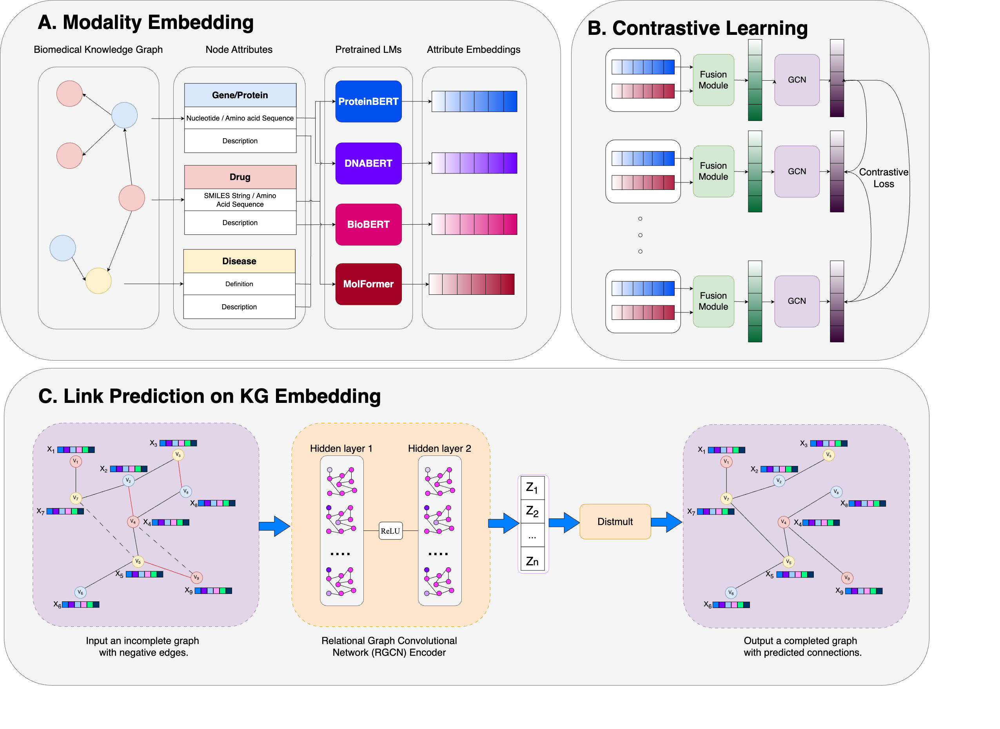

# Biomedical Knowledge Graph



## Setup
Copy the content of [.env-example](.env-example) into a new file named `.env`
```
cp .env-example .env
```
### Prepare data
Create a `data/` folder, then download the enhanced modality CSV files from Google Drive, and save them in `data/modalities/`


### Installation
Run the following command to build the module and install dependencies.
```
pip install -e .
```

### Get Modality Embedding
This command extracts embeddings for each modality in PrimeKG++. Refer to [primekg_modality.yaml](./primekg_modality.yaml) for details, including model name and modality type, etc.
```
python scripts/get_modality_embedding.py -f primekg_modality.yaml
```

## Train
You should ```export COMET_API_KEY=<your-comet-api-key>``` to track the training process on Comet dashboard, otherwise, it will be recorded in `log/` folder.

Run the following scripts with the flag `-h` for more information.
### Graph Contrastive Learning
To train a graph on contrastive learning with intra-node type, for example, with `gene`, try:
```
python scripts/train_gcl.py --model_name ggd --node_type gene --node_init_method llm --modality_transform_method attention 
```

### Get node embedding after training GCL
To obtain the node embedding after training with GCL, execute the following command to load the checkpoint and extract the embedding and save it at `./data/embed/`:
```
python scripts/get_embedding_from_ckpt.py --ckpt ./ckpt/gcl/*/*.ckpt --data primekg
```

### Knowledge Graph Embedding
Run the following command to execute Link Prediction on Knowledge Graph Embedding, where `--gcl_embed_path` is the path to gcl embeddings are recently created in the previous step:
```
python scripts/train_kge.py --gcl_embed_path ./data/embed/gcl_embed_folder --node_init_method gcl 
```

## Run FDI-DPA benchmark

### Additional data requirements:
* Download `dpi_fda.csv` to `data/benchmarks/`
* Download `dpi_drug_feature.csv` to `data/modalities/`
* Download `dpi_gene_feature.csv` to `data/modalities/`

### Get new modalities embeddings
To generate new language model embeddings from the recently crawled DPI information, run the following command:
```
python scripts/get_modality_embedding.py -f dpi_modality.yaml
```
### Get GCL embeddings
Retrieve the embedding from the GCL checkpoint using the path specified by `--gcl_embed_path` to the newly generated LLM embedding.
```
python scripts/get_embedding_from_ckpt.py --ckpt ./ckpt/gcl/*/*.ckpt --data biokg --gcl_embed_path ./data/embed/biokg_*
```
### K-Fold Cross validation on DPI-FDA
Run the following command to execute Link Prediction on DPI-FDA dataset:
```
python scripts/cross_val.py --ckpt_path ckpt/kge/*/*.ckpt --gcl_embed_path data/gcl_embed/biokg_* --max_epoch 100 --neg_ratio 10
```
